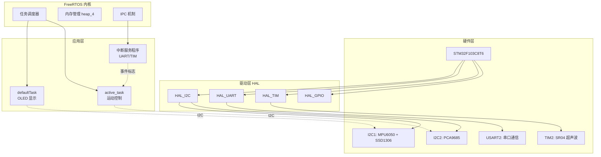

# STM32F103 机器人项目 - FreeRTOS 学习指南

## 📚 目录

1. [FreeRTOS 基础概念](#1-freertos-基础概念)
2. [项目架构分析](#2-项目架构分析)
3. [核心代码详解](#3-核心代码详解)
4. [实践练习](#4-实践练习)
5. [常见问题与调试](#5-常见问题与调试)
6. [进阶学习路径](#6-进阶学习路径)

---

## 1. FreeRTOS 基础概念

### 1.1 什么是 FreeRTOS？

**FreeRTOS** 是一个轻量级的实时操作系统内核，专为嵌入式系统设计。

**核心特性**：
- ✅ **抢占式调度**：高优先级任务可以打断低优先级任务
- ✅ **多任务并发**：多个任务"同时"运行（实际上是时间片轮转）
- ✅ **丰富的 IPC 机制**：队列、信号量、互斥量、事件标志等
- ✅ **内存管理**：提供多种堆管理方案
- ✅ **可移植性强**：支持 ARM Cortex-M、AVR、PIC 等多种架构

### 1.2 为什么需要 RTOS？

#### **传统裸机开发的问题**：
```c
// ❌ 裸机方式：轮询 + 延时，效率低下
while(1) {
    read_sensor();      // 读取传感器
    delay_ms(10);       // 阻塞等待
    update_display();   // 更新显示
    delay_ms(50);       // 阻塞等待
    check_communication(); // 检查通信
}
```

**问题**：
- ⚠️ CPU 浪费在空等上
- ⚠️ 响应速度慢（必须等当前操作完成）
- ⚠️ 代码耦合度高，难以维护

#### **RTOS 解决方案**：
```c
// ✅ RTOS 方式：多任务并行，高效响应
void sensor_task(void *arg) {
    while(1) {
        read_sensor();
        osDelay(10);  // 让出 CPU，其他任务可以运行
    }
}

void display_task(void *arg) {
    while(1) {
        update_display();
        osDelay(50);
    }
}

void comm_task(void *arg) {
    while(1) {
        check_communication();
        osDelay(5);
    }
}
```

**优势**：
- ✅ CPU 利用率高（无阻塞等待）
- ✅ 响应速度快（高优先级任务立即执行）
- ✅ 模块化设计，易于扩展

### 1.3 关键术语

| 术语 | 英文 | 说明 |
|------|------|------|
| **任务** | Task | 独立的执行线程，有自己的栈空间 |
| **调度器** | Scheduler | 决定哪个任务运行的内核组件 |
| **优先级** | Priority | 任务的执行优先程度（数值越大优先级越高） |
| **上下文切换** | Context Switch | 保存当前任务状态，恢复另一个任务状态 |
| **阻塞** | Blocked | 任务等待某个事件（如延时、信号量） |
| **就绪** | Ready | 任务可以运行，但等待 CPU |
| **运行** | Running | 任务正在 CPU 上执行 |
| **挂起** | Suspended | 任务被暂停，不参与调度 |

---

## 2. 项目架构分析

### 2.1 系统整体架构



### 2.2 FreeRTOS 配置参数

**配置文件**: [`Core/Inc/FreeRTOSConfig.h`](file://e:\E_ws\Github_ws\Robot_ESP32can\STM32F103-Robot\2、HAL_C8T6\Core\Inc\FreeRTOSConfig.h)

| 参数 | 值 | 说明 |
|------|-----|------|
| `configUSE_PREEMPTION` | 1 | 启用抢占式调度 |
| `configTICK_RATE_HZ` | 1000 | Tick 频率 1000Hz（1ms/ tick） |
| `configMAX_PRIORITIES` | 56 | 最大优先级数量（0-55） |
| `configMINIMAL_STACK_SIZE` | 128 | 最小栈大小（128 words = 512 bytes） |
| `configTOTAL_HEAP_SIZE` | 3072 | 总堆大小（3KB） |
| `configSUPPORT_DYNAMIC_ALLOCATION` | 1 | 支持动态内存分配 |
| `configSUPPORT_STATIC_ALLOCATION` | 1 | 支持静态内存分配 |
| `configUSE_TIMERS` | 1 | 启用软件定时器 |
| `configUSE_MUTEXES` | 1 | 启用互斥量 |
| `configUSE_COUNTING_SEMAPHORES` | 1 | 启用计数信号量 |

**内存布局**：
```
STM32F103C8T6 内存:
├─ Flash: 64KB (0x08000000 - 0x0800FFFF)
│   ├─ 代码段 (.text)
│   ├─ 常量数据 (.rodata)
│   └─ FreeRTOS 内核代码
│
└─ SRAM: 20KB (0x20000000 - 0x20004FFF)
    ├─ 静态变量 (.data, .bss)
    ├─ 主栈 (MSP)
    ├─ 进程栈 (PSP) - 各任务栈
    └─ FreeRTOS 堆 (3KB)
        ├─ defaultTask 栈: 512 bytes
        ├─ active_task 栈: 512 bytes
        └─ 剩余可用: ~2KB
```

### 2.3 任务列表

| 任务名称 | 优先级 | 栈大小 | 功能 | 周期 |
|---------|--------|--------|------|------|
| **defaultTask** | Normal (24) | 512 bytes | OLED 显示刷新 | 10ms |
| **active_task** | Low (23) | 512 bytes | 机器人运动控制 | 事件驱动 |

**优先级说明**：
- CMSIS-RTOS V2 优先级范围：0-55
- `osPriorityLow` = 23
- `osPriorityNormal` = 24
- `osPriorityHigh` = 25
- 数值越大，优先级越高

---

## 3. 核心代码详解

### 3.1 FreeRTOS 启动流程

**文件**: [`Core/Src/main.c`](file://e:\E_ws\Github_ws\Robot_ESP32can\STM32F103-Robot\2、HAL_C8T6\Core\Src\main.c)

```c
int main(void)
{
    // 1. HAL 库初始化
    HAL_Init();
    
    // 2. 系统时钟配置（72MHz）
    SystemClock_Config();
    
    // 3. 外设初始化
    MX_GPIO_Init();
    MX_I2C1_Init();      // MPU6050 + SSD1306
    MX_USART2_UART_Init(); // 串口通信
    MX_TIM2_Init();       // SR04 超声波
    
    // 4. 外设驱动初始化
    PCA_MG9XX_Init(55);   // PCA9685 PWM 频率 55Hz
    ssd1306_init();       // OLED 初始化
    MPU6050_Init();       // IMU 初始化
    HAL_UART_Receive_IT(&huart2, TempBuffer, 1); // 启动串口接收中断
    
    // 5. 初始化 FreeRTOS 调度器
    osKernelInitialize();
    
    // 6. 创建任务和同步对象
    MX_FREERTOS_Init();
    
    // 7. 启动调度器（永不返回）
    osKernelStart();
    
    // ⚠️ 代码永远不会执行到这里
    while(1) { }
}
```

**关键点**：
1. **`osKernelInitialize()`**：初始化调度器内部数据结构
2. **`MX_FREERTOS_Init()`**：创建所有任务和同步对象
3. **`osKernelStart()`**：启动调度器，控制权交给 FreeRTOS
4. **启动后**：CPU 由调度器管理，`main()` 函数不再执行

### 3.2 任务创建与实现

**文件**: [`Core/Src/freertos.c`](file://e:\E_ws\Github_ws\Robot_ESP32can\STM32F103-Robot\2、HAL_C8T6\Core\Src\freertos.c)

#### **任务属性定义**

```c
// defaultTask 属性
osThreadId_t defaultTaskHandle;
const osThreadAttr_t defaultTask_attributes = {
    .name = "defaultTask",           // 任务名称（调试用）
    .stack_size = 128 * 4,           // 栈大小：128 words = 512 bytes
    .priority = (osPriority_t)osPriorityNormal, // 优先级：24
};

// active_task 属性
osThreadId_t activeHandle;
const osThreadAttr_t active_attributes = {
    .name = "active",
    .stack_size = 128 * 4,           // 512 bytes
    .priority = (osPriority_t)osPriorityLow, // 优先级：23
};
```

**栈大小计算**：
- 1 word = 4 bytes（ARM Cortex-M3）
- `128 * 4 = 512 bytes`
- 每个任务独立栈空间，用于保存局部变量、函数调用链

#### **任务创建**

```c
void MX_FREERTOS_Init(void) {
    // 创建 defaultTask
    defaultTaskHandle = osThreadNew(StartDefaultTask, NULL, &defaultTask_attributes);
    
    // 创建 active_task
    activeHandle = osThreadNew(active_task, NULL, &active_attributes);
    
    // 创建事件标志
    activeEventHandle = osEventFlagsNew(&activeEvent_attributes);
}
```

**`osThreadNew()` 参数**：
1. **任务函数指针**：任务的入口函数
2. **参数指针**：传递给任务的参数（这里为 NULL）
3. **属性结构体**：栈大小、优先级等配置

#### **任务函数实现**

```c
// defaultTask：OLED 显示任务
void StartDefaultTask(void *argument)
{
    for(;;) {  // 无限循环
        display_oled();  // 更新 OLED 显示
        osDelay(10);     // 延时 10ms，让出 CPU
    }
}

// active_task：运动控制任务
void active_task(void *argument)
{
    for(;;) {
        // 等待事件标志（阻塞，不占用 CPU）
        osEventFlagsWait(activeEventHandle, 0x01, osFlagsWaitAny, osWaitForever);
        
        // 收到事件后进入运动循环
        while(1) {
            switch(activeTask) {
                case 1:  // 前进
                    if(SR04_GetData() <= 40) {
                        advance_bot_init();  // 障碍物，停止
                    } else {
                        advance();  // 无障碍，前进
                    }
                    break;
                case 2:  turn_left(); break;   // 左转
                case 3:  turn_right(); break;  // 右转
                case 4:  back(); break;        // 后退
                case 5:  advance_bot_init(); break; // 停止
            }
            osDelay(100);  // 每步延时 100ms
        }
    }
}
```

**关键机制**：
1. **`osDelay()`**：任务进入阻塞状态，调度器切换到其他任务
2. **`osEventFlagsWait()`**：等待事件标志，阻塞直到收到信号
3. **无限循环**：任务函数不能返回，否则会导致系统崩溃

### 3.3 中断与任务交互

**文件**: [`Core/Src/usart.c`](file://e:\E_ws\Github_ws\Robot_ESP32can\STM32F103-Robot\2、HAL_C8T6\Core\Src\usart.c)

#### **全局变量定义**

```c
extern osEventFlagsId_t activeEventHandle;  // 事件标志句柄
volatile uint8_t activeTask = 0;            // 当前活动状态
```

**`volatile` 关键字**：
- 告诉编译器该变量可能被意外修改（如中断中）
- 禁止编译器优化，每次都从内存读取最新值

#### **串口接收中断回调**

```c
void HAL_UART_RxCpltCallback(UART_HandleTypeDef *huart) {
    if(huart->Instance == USART2) {
        // 1. 存储接收到的字节
        RxBuffer[RxIndex++] = TempBuffer[0];
        if(RxIndex >= RX_BUFFER_SIZE) {
            RxIndex = 0;  // 环形缓冲区
        }
        
        // 2. 检查是否收到完整命令
        CheckForMessage();
        
        // 3. 重新启动接收中断
        HAL_UART_Receive_IT(&huart2, TempBuffer, 1);
    }
}
```

**工作流程**：
```
串口接收到 'Q' → 中断触发 → HAL_UART_RxCpltCallback()
                                ↓
                         RxBuffer[0] = 'Q'
                                ↓
                         CheckForMessage()
                                ↓
                         继续接收下一个字节
                                ↓
串口接收到 'B' → 中断触发 → HAL_UART_RxCpltCallback()
                                ↓
                         RxBuffer[1] = 'B'
                                ↓
                         CheckForMessage() 检测到 "QB"
                                ↓
                         osEventFlagsSet(activeEventHandle, 0x01)
                                ↓
                         activeTask = 1
                                ↓
                    active_task 从 osEventFlagsWait() 唤醒
                                ↓
                         执行前进动作
```

#### **命令解析函数**

```c
void CheckForMessage(void) {
    if(RxIndex >= 2) {
        for(uint16_t i = 0; i < RxIndex - 1; i++) {
            // 检测 "QB" 命令 → 前进
            if(RxBuffer[i] == 'Q' && RxBuffer[i+1] == 'B') {
                if(activeTask != 1) {  // 避免重复触发
                    osEventFlagsSet(activeEventHandle, 0x01);  // 设置事件标志
                    activeTask = 1;  // 设置状态
                }
                RxIndex = 0;  // 清空缓冲区
                break;
            }
            
            // 检测 "ZB" 命令 → 左转
            if(RxBuffer[i] == 'Z' && RxBuffer[i+1] == 'B') {
                if(activeTask != 2) {
                    osEventFlagsSet(activeEventHandle, 0x01);
                    activeTask = 2;
                }
                RxIndex = 0;
                break;
            }
            
            // ... 其他命令类似
        }
    }
}
```

**命令映射表**：

| 命令 | 含义 | activeTask 值 | 动作 |
|------|------|--------------|------|
| `QB` | Qian Jin (前进) | 1 | 前进（避障） |
| `ZB` | Zuo Bian (左边) | 2 | 左转 |
| `YB` | You Bian (右边) | 3 | 右转 |
| `HB` | Hou Bei (后备) | 4 | 后退 |
| `QS/ZS/YS/HS` | Ting Zhi (停止) | 5 | 停止 |

### 3.4 事件标志机制

**事件标志 (Event Flags)** 是 FreeRTOS 的一种轻量级同步机制。

#### **创建事件标志**

```c
osEventFlagsId_t activeEventHandle;
const osEventFlagsAttr_t activeEvent_attributes = {
    .name = "activeEvent"
};

// 在 MX_FREERTOS_Init() 中创建
activeEventHandle = osEventFlagsNew(&activeEvent_attributes);
```

#### **等待事件（任务侧）**

```c
// active_task 中
osEventFlagsWait(activeEventHandle, 
                 0x01,              // 等待的标志位
                 osFlagsWaitAny,    // 任意一位匹配即可
                 osWaitForever);    // 永久等待（阻塞）
```

**参数说明**：
- **`0x01`**：二进制 `0000 0001`，表示等待第 0 位
- **`osFlagsWaitAny`**：任意一位匹配就唤醒（还有 `osFlagsWaitAll`）
- **`osWaitForever`**：永久等待（还有 `osNoWait`、指定毫秒数）

**阻塞行为**：
- 任务调用 `osEventFlagsWait()` 后进入**阻塞状态**
- 不占用 CPU 时间
- 调度器切换到其他就绪任务（如 defaultTask）

#### **设置事件（中断侧）**

```c
// CheckForMessage() 中
osEventFlagsSet(activeEventHandle, 0x01);
```

**作用**：
- 将事件标志的第 0 位置 1
- 唤醒所有等待该标志的任务
- 任务从阻塞态转为就绪态

**从中断中调用 API**：
- FreeRTOS 提供了 ISR-safe 版本的 API
- CMSIS-RTOS V2 的 `osEventFlagsSet()` 可以在中断中安全调用

### 3.5 内存管理

**堆管理方案**: `heap_4.c`

**特点**：
- ✅ 支持内存释放
- ✅ 防止内存碎片（合并相邻空闲块）
- ❌ 不支持多区域内存

**内存分配示例**：
```c
// 动态创建任务时，FreeRTOS 自动从堆中分配：
// 1. 任务控制块 (TCB)
// 2. 任务栈空间

defaultTaskHandle = osThreadNew(StartDefaultTask, NULL, &defaultTask_attributes);
// ↑ 内部调用 pvPortMalloc() 分配 512 bytes 栈 + TCB
```

**内存使用估算**：
```
总堆大小: 3072 bytes

已分配:
- defaultTask: 512 (栈) + ~100 (TCB) ≈ 612 bytes
- active_task: 512 (栈) + ~100 (TCB) ≈ 612 bytes
- 事件标志: ~20 bytes
- 其他内核对象: ~100 bytes

总计: ~1344 bytes
剩余: ~1728 bytes (可用于动态创建更多任务)
```

---

## 4. 实践练习

### 4.1 练习 1：添加一个新任务

**目标**：创建一个 LED 闪烁任务，优先级低于 defaultTask

**步骤**：

#### **步骤 1：在 freertos.c 中添加任务属性和声明**

```c
/* Definitions for ledTask */
osThreadId_t ledTaskHandle;
const osThreadAttr_t ledTask_attributes = {
    .name = "ledTask",
    .stack_size = 128 * 4,  // 512 bytes
    .priority = (osPriority_t)osPriorityBelowNormal,  // 优先级 22
};

void LedTask(void *argument);  // 任务函数声明
```

#### **步骤 2：在 MX_FREERTOS_Init() 中创建任务**

```c
void MX_FREERTOS_Init(void) {
    // ... 现有代码 ...
    
    /* creation of ledTask */
    ledTaskHandle = osThreadNew(LedTask, NULL, &ledTask_attributes);
}
```

#### **步骤 3：实现任务函数**

```c
void LedTask(void *argument)
{
    for(;;) {
        HAL_GPIO_TogglePin(LED_GPIO_Port, LED_Pin);  // 翻转 LED
        osDelay(500);  // 延时 500ms
    }
}
```

#### **步骤 4：编译并烧录**

```bash
# 在 Keil 中
Project → Rebuild all target files
Flash → Download
```

**预期效果**：LED 以 1Hz 频率闪烁，不影响其他任务运行。

---

### 4.2 练习 2：使用队列进行任务间通信

**目标**：创建一个传感器数据队列，SR04 任务发送数据，显示任务接收并显示

#### **步骤 1：定义队列**

```c
// freertos.c
osMessageQueueId_t sensorQueueHandle;
const osMessageQueueAttr_t sensorQueue_attributes = {
    .name = "sensorQueue"
};

// 在 MX_FREERTOS_Init() 中创建
sensorQueueHandle = osMessageQueueNew(10, sizeof(float), &sensorQueue_attributes);
// 队列深度: 10, 每个元素大小: sizeof(float)
```

#### **步骤 2：修改 SR04 任务发送数据**

```c
// 假设有一个 SR04_task
void SR04_Task(void *argument)
{
    float distance;
    
    for(;;) {
        distance = SR04_GetData();  // 读取距离
        
        // 发送到队列（阻塞等待队列有空位）
        osMessageQueuePut(sensorQueueHandle, &distance, 0, osWaitForever);
        
        osDelay(100);  // 100ms 采样率
    }
}
```

#### **步骤 3：修改显示任务接收数据**

```c
void StartDefaultTask(void *argument)
{
    float distance;
    char buffer[20];
    
    for(;;) {
        // 从队列接收数据（阻塞等待数据到达）
        if(osMessageQueueGet(sensorQueueHandle, &distance, 0, 10) == osOK) {
            // 格式化并显示
            snprintf(buffer, sizeof(buffer), "Dist: %.1f cm", distance);
            ssd1306_set_cursor(0, 20);
            ssd1306_write_string(font6x8, buffer);
        }
        
        display_oled();
        osDelay(10);
    }
}
```

**优势**：
- ✅ 解耦：SR04 任务和显示任务无需知道彼此存在
- ✅ 缓冲：队列可以暂存多个数据
- ✅ 同步：自动处理任务间的时序问题

---

### 4.3 练习 3：使用互斥量保护共享资源

**问题场景**：两个任务都需要访问 I2C 总线，可能导致冲突

**解决方案**：使用互斥量（Mutex）

```c
// 定义互斥量
osMutexId_t i2cMutexHandle;
const osMutexAttr_t i2cMutex_attributes = {
    .name = "i2cMutex"
};

// 在 MX_FREERTOS_Init() 中创建
i2cMutexHandle = osMutexNew(&i2cMutex_attributes);

// 任务 1：读取 MPU6050
void MpuTask(void *argument)
{
    GyroData data;
    
    for(;;) {
        osMutexAcquire(i2cMutexHandle, osWaitForever);  // 获取锁
        
        MPU6050_GetAccelData(&data);  // 访问 I2C
        
        osMutexRelease(i2cMutexHandle);  // 释放锁
        
        osDelay(10);
    }
}

// 任务 2：写入 PCA9685
void PwmTask(void *argument)
{
    for(;;) {
        osMutexAcquire(i2cMutexHandle, osWaitForever);  // 获取锁
        
        PCA_MG9XX(0, 90);  // 访问 I2C
        
        osMutexRelease(i2cMutexHandle);  // 释放锁
        
        osDelay(50);
    }
}
```

**工作原理**：
```
时刻 T1: MpuTask 获取互斥量 → 独占 I2C
时刻 T2: PwmTask 尝试获取 → 阻塞等待
时刻 T3: MpuTask 释放互斥量 → PwmTask 获得锁
时刻 T4: PwmTask 访问 I2C → 完成后释放
```

---

## 5. 常见问题与调试

### 5.1 栈溢出

**症状**：
- 系统崩溃或重启
- 任务行为异常
- HardFault 中断

**检测方法**：

#### **方法 1：启用栈溢出钩子**

在 `FreeRTOSConfig.h` 中启用：
```c
#define configCHECK_FOR_STACK_OVERFLOW  2
```

实现钩子函数：
```c
void vApplicationStackOverflowHook(TaskHandle_t xTask, char *pcTaskName)
{
    // 任务名和句柄
    printf("Stack overflow in task: %s\n", pcTaskName);
    
    // 进入死循环，方便调试
    while(1) {
        HAL_GPIO_TogglePin(LED_GPIO_Port, LED_Pin);
        HAL_Delay(100);
    }
}
```

#### **方法 2：监控栈高水位线**

```c
// 在任务中定期检查
UBaseType_t uxHighWaterMark = uxTaskGetStackHighWaterMark(NULL);
printf("Task '%s' stack remaining: %d words\n", 
       pcTaskGetName(NULL), uxHighWaterMark);

// 如果返回值接近 0，说明栈快溢出了
```

**解决方法**：
1. 增加任务栈大小：`.stack_size = 256 * 4` (1024 bytes)
2. 减少局部变量使用
3. 避免递归调用
4. 使用动态内存分配代替大数组

---

### 5.2 优先级反转

**问题描述**：
```
低优先级任务持有互斥量
    ↓
中优先级任务抢占低优先级任务
    ↓
高优先级任务等待互斥量（被中优先级任务阻塞）
    ↓
结果：高优先级任务被中优先级任务"间接"阻塞
```

**解决方案**：使用互斥量（而非二值信号量）

```c
// ❌ 错误：使用二值信号量
osSemaphoreId_t sem = osSemaphoreNew(1, 1, NULL);
osSemaphoreAcquire(sem, osWaitForever);
// 临界区
osSemaphoreRelease(sem);

// ✅ 正确：使用互斥量
osMutexId_t mutex = osMutexNew(NULL);
osMutexAcquire(mutex, osWaitForever);
// 临界区
osMutexRelease(mutex);
```

**互斥量的特性**：
- 自动提升持有者的优先级（优先级继承）
- 防止优先级反转

---

### 5.3 死锁

**典型场景**：
```c
// 任务 1
osMutexAcquire(mutexA, osWaitForever);
osMutexAcquire(mutexB, osWaitForever);  // 等待 mutexB

// 任务 2
osMutexAcquire(mutexB, osWaitForever);
osMutexAcquire(mutexA, osWaitForever);  // 等待 mutexA
```

**结果**：两个任务互相等待，永久阻塞

**预防方法**：
1. **固定获取顺序**：所有任务都按 A→B 顺序获取
2. **使用超时**：
   ```c
   if(osMutexAcquire(mutexB, pdMS_TO_TICKS(100)) != osOK) {
       // 超时，释放已获取的锁并重试
       osMutexRelease(mutexA);
       osDelay(10);
   }
   ```
3. **避免嵌套锁**：尽量减少同时持有多个锁

---

### 5.4 调试技巧

#### **技巧 1：使用 FreeRTOS CLI**

启用命令行接口，通过串口查询系统状态：
```c
// 需要添加 FreeRTOS-Plus-CLI 库
vRegisterCLICommands();
```

常用命令：
```
task-list          # 列出所有任务及其状态
task-stats         # 显示任务统计信息
heap-stats         # 显示堆使用情况
queue-info         # 显示队列状态
```

#### **技巧 2：使用 Trace 工具**

- **Percepio Tracealyzer**：可视化任务调度
- **SystemView**：SEGGER 的系统分析工具

#### **技巧 3：LED 调试法**

```c
// 在关键位置翻转 LED，用示波器观察时序
HAL_GPIO_WritePin(DEBUG_GPIO_Port, DEBUG_Pin, GPIO_PIN_SET);
// 临界区代码
HAL_GPIO_WritePin(DEBUG_GPIO_Port, DEBUG_Pin, GPIO_PIN_RESET);
```

---

## 6. 进阶学习路径

### 6.1 推荐学习资源

#### **官方文档**
1. [FreeRTOS 官方文档](https://www.freertos.org/Documentation/api-ref/index.html)
2. [CMSIS-RTOS V2 参考](https://arm-software.github.io/CMSIS_5/RTOS2/html/index.html)
3. [FreeRTOS 书籍](https://www.freertos.org/Documentation/03-Libraries/02-FreeRTOS-plus/01-FreeRTOS-Plus-TCP/02-API-reference/01-General/00-Introduction)

#### **视频教程**
- YouTube: "FreeRTOS Tutorial" by FastBit Embedded Brain
- Bilibili: "STM32 + FreeRTOS 实战教程"

#### **书籍**
- 《Mastering the FreeRTOS Real Time Kernel》
- 《Using the FreeRTOS Real Time Kernel》

### 6.2 进阶主题

#### **主题 1：软件定时器**

```c
// 创建一次性定时器
osTimerId_t myTimer;
void TimerCallback(void *argument) {
    printf("Timer expired!\n");
}

myTimer = osTimerNew(TimerCallback, osTimerOnce, NULL, NULL);
osTimerStart(myTimer, 1000);  // 1 秒后触发
```

#### **主题 2：任务通知（Task Notifications）**

比信号量更轻量的同步机制：
```c
// 发送通知
osThreadFlagsSet(taskHandle, 0x01);

// 等待通知
osThreadFlagsWait(0x01, osFlagsWaitAny, osWaitForever);
```

#### **主题 3：流缓冲区（Stream Buffer）**

用于连续数据流（如音频、传感器数据）：
```c
osStreamBufferId_t streamBuf;
streamBuf = osStreamBufferNew(1024, 1, NULL);  // 1024 bytes, 1 byte trigger

// 发送
osStreamBufferSend(streamBuf, data, length, 0);

// 接收
osStreamBufferReceive(streamBuf, buffer, length, 0);
```

#### **主题 4：低功耗模式**

```c
// 空闲钩子中进入睡眠
void vApplicationIdleHook(void) {
    __WFI();  // Wait For Interrupt，进入睡眠模式
}
```

### 6.3 项目扩展建议

#### **建议 1：添加看门狗任务**

```c
void WatchdogTask(void *argument)
{
    for(;;) {
        // 检查各任务是否正常
        if(eTaskGetState(defaultTaskHandle) != eRunning) {
            // 任务异常，重启系统
            NVIC_SystemReset();
        }
        
        osDelay(1000);
    }
}
```

#### **建议 2：实现状态机**

```c
typedef enum {
    STATE_IDLE,
    STATE_MOVING,
    STATE_OBSTACLE,
    STATE_ERROR
} RobotState;

RobotState currentState = STATE_IDLE;

void StateMachineTask(void *argument)
{
    for(;;) {
        switch(currentState) {
            case STATE_IDLE:
                // 等待命令
                break;
            case STATE_MOVING:
                // 执行运动
                break;
            case STATE_OBSTACLE:
                // 避障逻辑
                break;
            case STATE_ERROR:
                // 错误处理
                break;
        }
        osDelay(10);
    }
}
```

#### **建议 3：添加日志系统**

```c
#include <stdarg.h>

void LogPrint(const char *format, ...)
{
    char buffer[128];
    va_list args;
    va_start(args, format);
    vsnprintf(buffer, sizeof(buffer), format, args);
    va_end(args);
    
    HAL_UART_Transmit(&huart1, (uint8_t*)buffer, strlen(buffer), 100);
}

// 使用
LogPrint("[TASK] defaultTask running, stack: %d\n", 
         uxTaskGetStackHighWaterMark(NULL));
```

---

## 📝 总结

### **本项目 FreeRTOS 要点回顾**

1. ✅ **双任务架构**：显示任务 + 运动控制任务
2. ✅ **事件驱动**：串口中断通过事件标志唤醒任务
3. ✅ **优先级设计**：显示任务优先级高于运动任务
4. ✅ **内存管理**：使用 heap_4，总堆 3KB
5. ✅ **CMSIS-RTOS V2**：标准化 API，便于移植

### **下一步行动**

1. **动手实践**：完成上述 3 个练习
2. **阅读源码**：深入理解 `tasks.c`, `queue.c` 实现
3. **调试优化**：使用栈监控工具优化内存使用
4. **扩展功能**：添加新任务、队列、定时器等

### **常见误区提醒**

❌ **不要在任务函数中 return**  
✅ 任务必须是无限循环

❌ **不要在中断中调用阻塞 API**  
✅ 使用 ISR-safe 版本（如 `osEventFlagsSetFromISR`）

❌ **不要忽略栈溢出风险**  
✅ 启用 `configCHECK_FOR_STACK_OVERFLOW`

❌ **不要滥用全局变量**  
✅ 优先使用队列、信号量等 IPC 机制

---

**祝您学习愉快！如有疑问，随时提问。** 🚀
